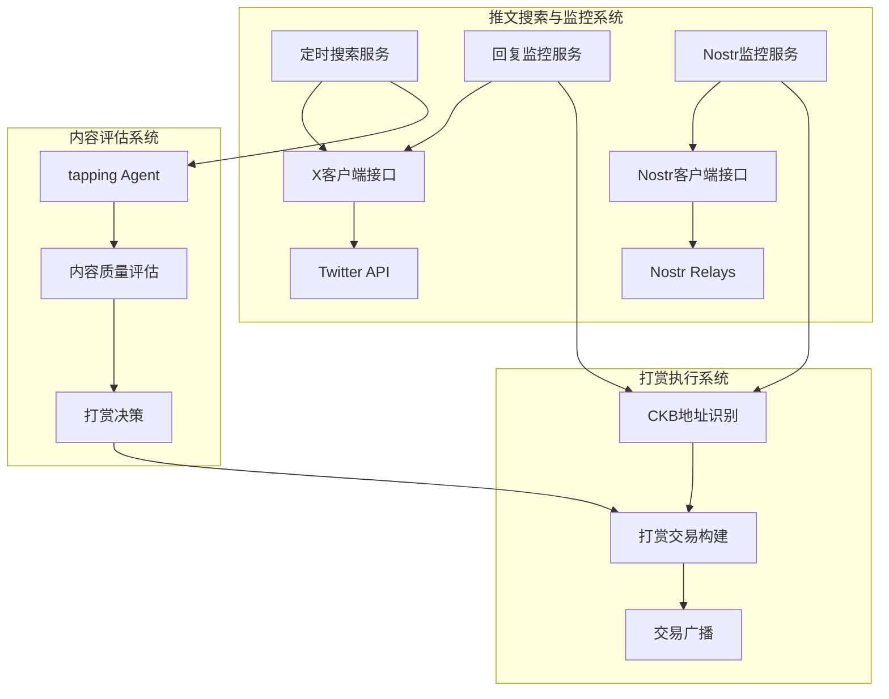
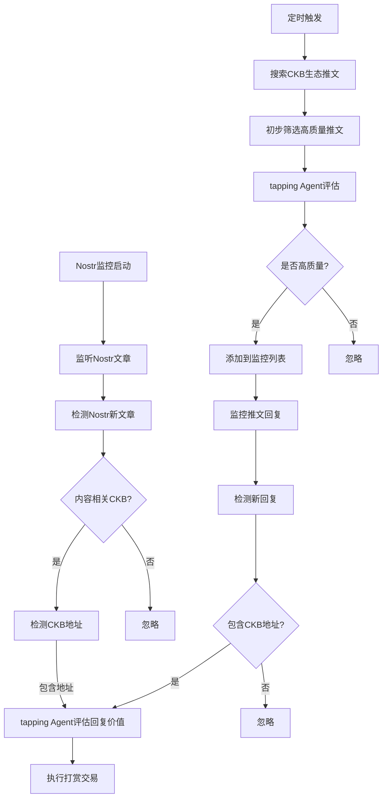
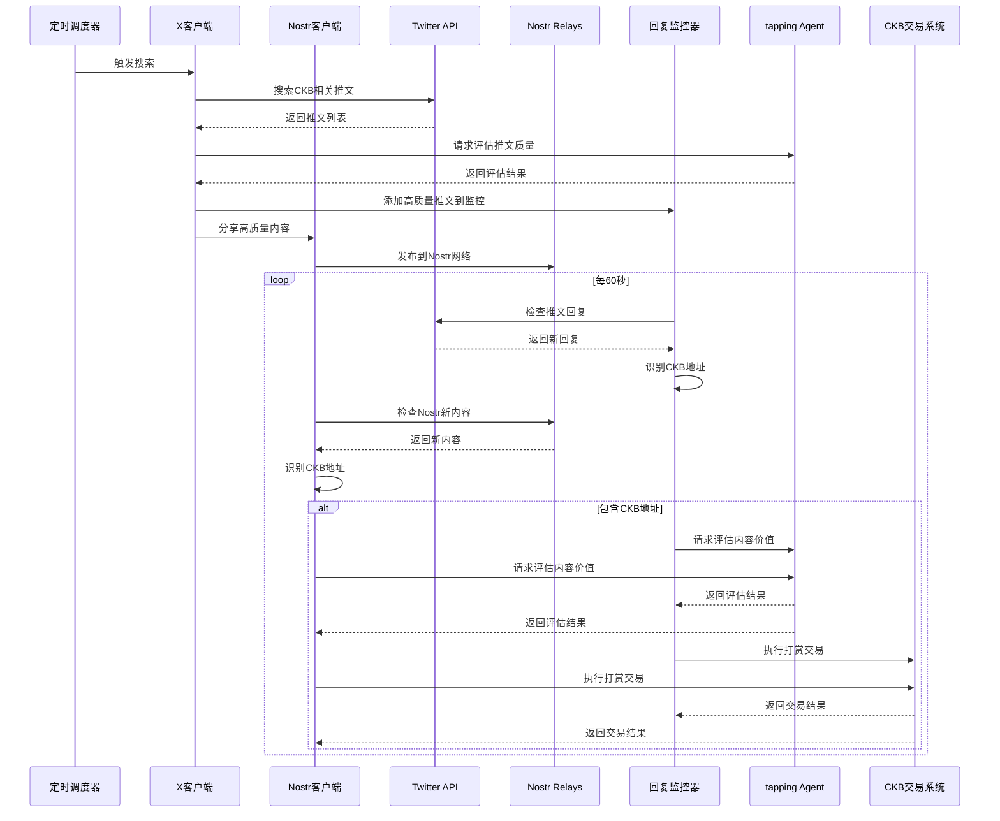

# Tapping Agent

这是一个 CKB 生态内容互动打赏 Agent，可以监控推文回复并自动打赏包含 CKB 地址的回复。

## 功能特点

- 自动监控指定推文的回复
- 识别回复中的 CKB 地址
- 使用 tappingAgent 自动打赏有价值的内容
- 支持通过环境变量配置监控参数
- 定期搜索 CKB 生态相关推文并进行质量评估
- 自动与高质量推文互动（点赞、转发）
- **支持 Nostr 去中心化社交协议**，监控和打赏 Nostr 平台上的 CKB 内容

## 系统架构

整个系统由以下几个核心组件构成：

```
+---------------------+    +---------------------+    +---------------------+
|                     |    |                     |    |                     |
|  推文搜索与监控系统  |    |    内容评估系统     |    |     打赏执行系统     |
|                     |    |                     |    |                     |
+----------+----------+    +----------+----------+    +----------+----------+
           |                          |                          |
           v                          v                          v
+----------+----------+    +----------+----------+    +----------+----------+
|                     |    |                     |    |                     |
|  Twitter/Nostr API  |    |   tapping Agent     |    |     CKB 交易系统    |
|                     |    |                     |    |                     |
+---------------------+    +---------------------+    +---------------------+
```

### 详细架构图



### 组件说明

1. **推文搜索与监控系统**
   - 定期搜索 CKB 生态相关推文
   - 监控指定推文的回复
   - 识别回复中的 CKB 地址
   - **监控 Nostr 平台上的 CKB 相关内容**

2. **内容评估系统**
   - 评估推文质量
   - 决定是否监控推文回复
   - 评估回复内容价值

3. **打赏执行系统**
   - 根据内容价值决定打赏金额
   - 执行 CKB 转账交易
   - 记录打赏结果

## 技术实现

### 工作流程

```
+----------------+     +----------------+     +----------------+
| 定时搜索推文    | --> | 初步筛选推文    | --> | tapping Agent  |
+----------------+     +----------------+     | 评估推文质量    |
                                              +--------+-------+
                                                       |
                                                       v
+----------------+     +----------------+     +----------------+
| 执行打赏交易    | <-- | tapping Agent  | <-- | 监控高质量推文  |
+----------------+     | 评估回复价值    |     | 的回复         |
                       +----------------+     +----------------+
```

### 详细工作流程图



### 核心模块

1. **CKB 生态监控工作流 (`ckbEcosystemMonitor`)**
   - 每天定时执行（上午 10 点和下午 6 点）
   - 搜索 CKB 相关关键词的推文
   - 使用 tapping Agent 评估推文质量
   - 监控高质量推文的回复
   - **将高质量内容分享到 Nostr 平台**

2. **回复监控系统 (`ReplyMonitor`)**
   - 每 60 秒检查一次推文回复
   - 识别回复中的 CKB 地址
   - 触发打赏流程

3. **X 客户端接口 (`createXClient`)**
   - 封装 Twitter API 调用
   - 提供搜索、回复、点赞、转发等功能
   - 处理错误和重试逻辑

4. **Nostr 监控系统 (`NostrMonitor`)**
   - 连接到多个 Nostr Relay 服务器
   - 监控 CKB 相关的 Nostr 内容
   - 识别内容中的 CKB 地址
   - 触发打赏流程
   - 分享高质量内容

5. **tapping Agent**
   - 评估内容质量和价值
   - 决定打赏金额
   - 执行打赏操作

### 数据流图



### 技术栈

本项目使用以下技术栈：

- **后端**：Node.js + TypeScript
- **Twitter API**：twitter-api-v2 库
- **Nostr 协议**：nostr-tools 库
- **定时任务**：node-schedule
- **AI 模型**：Openai LLM (基于 mastra 框架)
- **区块链交互**：CKB CCC SDK

### 代码结构

```
src/
├── index.ts                     # 应用入口
├── mastra/
│   └── agents/
│       └── tappingAgent.ts      # 打赏 Agent 实现
├── lib/
│   ├── replyMonitor.ts          # Twitter 回复监控系统
│   ├── nostrMonitor.ts          # Nostr 监控系统
│   └── x.ts                     # X 客户端接口
└── workflows/
    └── ckbEcosystemMonitor.ts   # CKB 生态监控工作流
```

## 安装与配置

1. 克隆仓库
```bash
git clone https://github.com/yourusername/tapping-agent.git
cd tapping-agent
```

2. 安装依赖
```bash
npm install
```

3. 配置环境变量
```bash
cp .env.example .env
```
然后编辑 `.env` 文件，填写以下信息：
- Twitter API 凭证 (TWITTER_API_KEY, TWITTER_API_SECRET, TWITTER_ACCESS_TOKEN, TWITTER_ACCESS_SECRET)
- Twitter 用户 ID (TWITTER_USER_ID)
- 监控间隔时间 (MONITOR_INTERVAL)，单位为毫秒，默认为 60000（60秒）
- 预设监控的推文 ID (MONITORED_TWEETS)，多个 ID 用逗号分隔
- CKB 生态监控设置 (RUN_ECOSYSTEM_MONITOR_IMMEDIATELY, ECOSYSTEM_MONITOR_MORNING_TIME, ECOSYSTEM_MONITOR_EVENING_TIME)
- Nostr 设置 (NOSTR_PRIVATE_KEY, NOSTR_RELAYS, NOSTR_MONITOR_INTERVAL)
- 打赏设置 (MIN_TIPPING_AMOUNT, MAX_TIPPING_AMOUNT, DEFAULT_TIPPING_AMOUNT)

### Nostr 配置与测试

1. 生成 Nostr 密钥对
```bash
npm run gen-nostr-key
```
这将生成一个 Nostr 密钥对，将私钥添加到 `.env` 文件中的 `NOSTR_PRIVATE_KEY` 变量。

2. 测试 Nostr 功能
```bash
# 监听 Nostr 网络上的 CKB 相关内容
npm run test-nostr

# 发布一条测试消息到 Nostr 网络
npm run test-nostr:publish
```

3. 运行完整的 Nostr 监控服务
```bash
npm run nostr
```

## Nostr 集成说明

本项目集成了 Nostr 协议，作为一个去中心化的社交媒体平台补充。Nostr 集成实现了以下功能：

1. **监控 Nostr 内容**：通过连接到多个中继服务器，监控包含 CKB 相关标签的 Nostr 笔记。

2. **自动打赏**：识别包含 CKB 地址的 Nostr 笔记，使用 tapping Agent 评估内容质量，并执行打赏交易。

3. **内容分享**：将高质量的 CKB 相关内容从 Twitter 分享到 Nostr 网络，扩大内容影响力。

4. **双平台互动**：同时支持 Twitter 和 Nostr 两个平台，增加内容覆盖面和互动机会。

### Nostr 技术实现

Nostr 集成主要通过 `NostrMonitor` 类实现，该类提供以下功能：

- 连接到多个 Nostr 中继服务器
- 订阅 CKB 相关标签的事件
- 识别内容中的 CKB 地址
- 评估内容质量并执行打赏
- 发布内容到 Nostr 网络

Nostr 依赖 `nostr-tools` 库实现基本功能，包括密钥管理、事件创建、签名和验证等。

## 使用方法

### 方法一：使用启动脚本

```bash
chmod +x start.sh
./start.sh
```

### 方法二：手动启动

1. 编译 TypeScript
```bash
npm run build
```

2. 启动应用
```bash
npm start
```

### 方法三：使用 tsx 直接运行（开发模式）

```bash
npm run monitor
```

## 监控推文

有两种方式可以监控推文：

1. 通过环境变量预设监控的推文 ID
   在 `.env` 文件中设置 `MONITORED_TWEETS` 变量

2. 通过 API 动态添加监控
   ```typescript
   // 使用工作流添加监控
   await mastra.workflows.xWorkflow.trigger({
     action: 'start-monitoring-tweet',
     tweetId: '1234567890'
   });
   ```

## CKB 生态监控

系统会自动定期搜索和监控 CKB 生态相关内容：

1. **定时搜索**：每天上午 10 点和下午 6 点自动执行
2. **关键词**：使用预定义的 CKB 相关关键词搜索
3. **质量评估**：使用 tapping Agent 评估内容质量
4. **自动互动**：对高质量推文进行点赞和转发
5. **回复监控**：监控高质量推文的回复，识别 CKB 地址
6. **Nostr 分享**：将高质量内容分享到 Nostr 平台
7. **Nostr 监控**：监控 Nostr 平台上的 CKB 相关内容

可以通过环境变量配置监控行为：
- `RUN_ECOSYSTEM_MONITOR_IMMEDIATELY`：是否在启动时立即执行一次生态监控
- `ECOSYSTEM_MONITOR_MORNING_TIME`：每天上午监控时间（小时，24小时制）
- `ECOSYSTEM_MONITOR_EVENING_TIME`：每天下午监控时间（小时，24小时制）
- `NOSTR_RELAYS`：Nostr Relay 服务器列表，多个地址用逗号分隔
- `NOSTR_MONITOR_INTERVAL`：Nostr 监控间隔时间

## Nostr 支持

系统支持 Nostr 协议，实现以下功能：

1. **监控 Nostr 内容**：自动监控 Nostr 平台上的 CKB 相关内容
2. **识别 CKB 地址**：从 Nostr 内容中提取 CKB 地址
3. **自动打赏**：对有价值的 Nostr 内容进行打赏
4. **内容分享**：将高质量的 X 平台内容分享到 Nostr 平台

配置 Nostr：
- 设置 `NOSTR_PRIVATE_KEY` 环境变量指定私钥，如不设置则自动生成
- 通过 `NOSTR_RELAYS` 配置要连接的 Relay 服务器
- 使用 `initNostrOnly` 触发器仅初始化 Nostr 监控：
  ```typescript
  await mastra.workflows.ckbEcosystemMonitor.trigger('initNostrOnly');
  ```

## 自动打赏逻辑

当检测到包含 CKB 地址的回复或 Nostr 内容时，系统会：

1. 提取内容中的 CKB 地址
2. 调用 tapping Agent 进行内容价值评估
3. 根据内容价值自动进行打赏

打赏金额可通过环境变量配置：
- `MIN_TIPPING_AMOUNT`：最小打赏金额（CKB）
- `MAX_TIPPING_AMOUNT`：最大打赏金额（CKB）
- `DEFAULT_TIPPING_AMOUNT`：默认打赏金额（CKB）

## 日志

应用运行时会在控制台输出日志，包括：
- 监控服务的启动和停止
- 新添加和移除的监控推文
- 检测到的新回复
- 打赏操作的结果
- 生态监控的执行情况和结果
- Nostr 监控和交互的状态

## 许可证

MIT